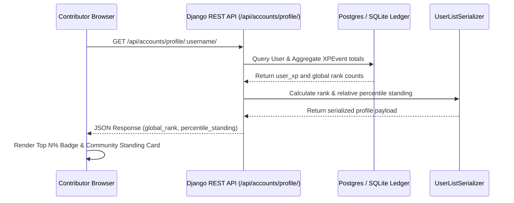

# Global Rank Percentile Standing Specification

## 1. Context and Problem
Contributors want clear visibility into how their open source contributions and learning milestones place them relative to the broader developer community.
Prior to this enhancement, the User Profile page only rendered raw XP and completed lesson counts without relative percentile context.

## 2. Solution & Percentile Rank Engine
1. **Dynamic Percentile Computation (`apps/accounts/serializers.py`)**:
   - Computes total cumulative user XP via `XPEvent.objects.filter(user=obj).aggregate(total=Sum('xp_delta'))`.
   - Determines the user's global absolute rank by counting all users whose cumulative XP exceeds the target user's XP.
   - Derives relative percentile standing:
     ```python
     rank = higher_count + 1
     percentile = max(1, int(round((rank / total_users) * 100)))
     ```
2. **Public Profile API Exposure (`/api/auth/profile/<username>/` & `/api/accounts/profile/<username>/`)**:
   - `UserListSerializer` embeds `global_rank` and `percentile_standing` directly in profile responses.
3. **Frontend UI Badge & Stats (`UserProfilePage.tsx`)**:
   - Renders a prominent Neobrutalist gradient pill badge:
     `Top {percentile}% Contributor` with a trophy icon.
   - Includes a dedicated `Global Standing` card within the Statistics widget detailing community placement.

## 3. Percentile Standing Tier Matrix
| Cumulative XP Tier | Relative Percentile | UI Badge Style | Icon |
| --- | --- | --- | --- |
| >= 1000 XP | Top 5% Contributor | Gradient Amber / Orange (`from-amber-400 to-orange-500`) | `Trophy` |
| >= 500 XP | Top 10% Contributor | Gradient Yellow / Amber | `Trophy` |
| >= 100 XP | Top 25% Contributor | Gradient Blue / Indigo | `TrendingUp` |
| < 100 XP | Top 50% Contributor | Subtle Slate / White | `Award` |

## 4. Architectural Sequence


## 5. Verification Checklist
- [x] Backend unit tests in `backend/apps/accounts/tests/test_global_rank_percentile.py` validate:
  - Multi-user rank ordering.
  - Accurate percentile calculations across user cohorts.
  - Serializer field exposure on public profile endpoints.
  - Tied XP ranking and single-user baseline handling.
- [x] Frontend test suite in `frontend/src/test/UserProfileRankBadge.test.tsx` validates:
  - Badge rendering below username with `data-testid="rank-percentile-badge"`.
  - Statistics widget community standing card.
  - Correct formatting of lessons, XP, bio, and achievements.
  - Social sharing copy-link interactions.
