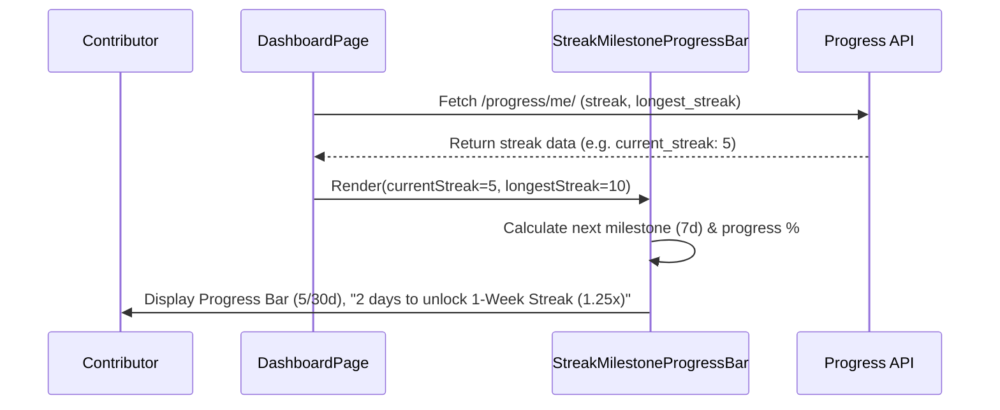

# Streak Milestone Progress Bar Specification

## 1. Context and Problem
Contributors tracking their daily habit streaks lacked a granular, visual indicator of their progression towards the next reward tiers and milestone XP multiplier unlocks.
While the dashboard displayed raw day count, users had to remember or look up when their multipliers would increase.

## 2. Solution & UI Architecture
1. **Component Design (`StreakMilestoneProgressBar.tsx`)**:
   - Encapsulates accessible Neobrutalist design with thick dark borders (`border-4 border-black`), vibrant gradients, and high contrast.
   - Computes dynamic percentage to next and final milestone targets:
     `progressPercent = min(100, round((currentStreak / maxDays) * 100))`.
   - Incorporates ARIA accessibility standards: `role="progressbar"`, `aria-valuenow`, `aria-valuemin`, `aria-valuemax`, and descriptive `aria-label`.
2. **Milestone Pin Checkpoints**:
   - Visual step markers for `3-Day Sprint (1.1x)`, `1-Week Streak (1.25x)`, `2-Week Master (1.5x)`, and `1-Month Legend (2.0x)`.
   - Unlocked milestones display a green check badge (`CheckCircle2`); locked milestones display required day markers.
3. **Integration Point (`DashboardPage.tsx`)**:
   - Mounted directly in the central feed below the hero learning section.

## 3. Milestone Multiplier Mapping
| Milestone Tier | Day Threshold | Multiplier Boost | Badge Icon | Unlocked State |
| --- | --- | --- | --- | --- |
| 3-Day Sprint | 3 Days | 1.10x | `Flame` | `CheckCircle2` (Green Pill) |
| 1-Week Streak | 7 Days | 1.25x | `CheckCircle2` | `CheckCircle2` (Green Pill) |
| 2-Week Master | 14 Days | 1.50x | `Trophy` | `CheckCircle2` (Green Pill) |
| 1-Month Legend | 30 Days | 2.00x | `Award` | `CheckCircle2` (Green Pill) |

## 4. Architectural Sequence

## 5. Verification Checklist
- [x] Frontend test suite in `frontend/src/test/StreakMilestoneProgressBar.test.tsx` validates:
  - Accessible `role="progressbar"` attributes and ARIA labels.
  - Correct remaining day calculations and singular/plural grammar.
  - Max milestone reached state handling.
  - Unlocked vs. locked milestone checkpoints.
  - Zero-streak baseline and custom milestone configuration support.
  - CSS styling and percentage width style bindings.
