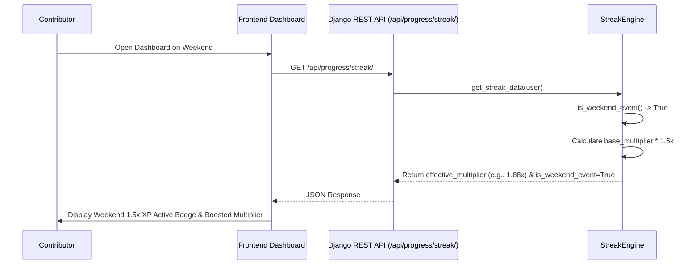

# Weekend XP Bonus Multiplier Specification

## 1. Context and Problem
To incentivize active open source contributions and study sprints during community hackathons and weekend contribution events, the platform introduces a global **1.5x Weekend XP Bonus Multiplier**.
Contributors completing learning modules, daily challenges, and PR reviews on Saturdays and Sundays earn 150% standard XP on all contributions.

## 2. Multiplier Architecture & Logic
1. **Weekend Event Detection (`apps/progress/streak_engine.py`)**:
   - Evaluates whether the activity or request date falls on a weekend:
     ```python
     @staticmethod
     def is_weekend_event(current_date: Optional[Union[date, datetime]] = None) -> bool:
         if current_date is None:
             current_date = timezone.now().date()
         elif isinstance(current_date, datetime):
             current_date = current_date.date()
         return current_date.weekday() in (5, 6) # Saturday (5), Sunday (6)
     ```
2. **Effective Multiplier Compounding**:
   - The user's active streak milestone multiplier (e.g., 1.25x for a 7-day streak) is multiplied by 1.5x during weekend events:
     `effective_multiplier = round(base_multiplier * 1.5, 2)` (yielding 1.88x).
3. **API Integration (`/api/progress/streak/` & `/api/progress/me/`)**:
   - Exposes `effective_multiplier` and `is_weekend_event` boolean flags.
4. **Dashboard Visual Indicator (`DashboardPage.tsx`)**:
   - Streak card renders a vibrant yellow pill badge with a lightning icon:
     `Weekend Event: 1.5x XP Active`.

## 3. Multiplier Milestone Matrix
| Streak Days | Base Multiplier | Weekend Multiplier (1.5x Boost) | Milestone Badge |
| --- | --- | --- | --- |
| 1–2 Days | 1.0x | 1.50x | Starter Flame |
| 3–6 Days | 1.10x | 1.65x | 3-Day Sprint |
| 7–13 Days | 1.25x | 1.88x | 1-Week Champion |
| 14–29 Days | 1.50x | 2.25x | 2-Week Master |
| 30+ Days | 2.00x | 3.00x | Monthly Legend |

## 4. Architectural Event Flow


## 5. Verification Checklist
- [x] Backend test suite in `backend/apps/progress/tests/test_weekend_xp_multiplier.py` validates:
  - Weekend date detection across calendar days.
  - Multiplier compounding on base streak milestones (3d, 7d, 14d, 30d).
  - API endpoint response payloads containing `effective_multiplier` and `is_weekend_event`.
  - Idempotent activity recording on weekend dates.
  - Non-existent user profile fallback behavior.
- [x] Frontend test suite in `frontend/src/test/WeekendXpMultiplier.test.tsx` validates:
  - Rendering of `weekend-xp-multiplier-badge` on dashboard streak card.
  - Accurate streak statistics display.
  - Display of effective multiplier values.
  - Proper omission of weekend badge during standard weekdays.
